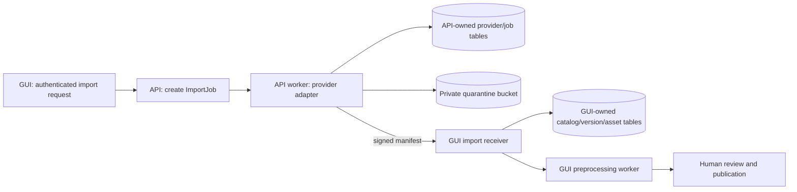

# DataHub API: cleanup and integration plan

Reviewed: 2026-10-01  
Source reviewed: `../datahub_api`  
Related application: `datahub_gui`  
Status: baseline implementation completed on 2026-10-01; continue with the rollout milestones below.

The first cleanup slice is now implemented in `../datahub_api`: a separate `ingestion` app owns provider/job/file tables and migrations, signed idempotent import-job endpoints are available under `/api/v1/import-jobs/`, Hugging Face and Kaggle adapters are isolated from HTTP views, and a management-command worker uploads checksummed files to an S3 quarantine prefix before sending the GUI a signed multi-file manifest. The active API settings are environment-driven, Docker builds as a non-root Gunicorn image with a writable Kaggle SDK home, and the API has a UTF-8 dependency file, `.env.example`, `.dockerignore`, and six ingestion regression tests. The adapters have been smoke-tested end-to-end with Hugging Face `lhoestq/demo1` and Kaggle `uciml/iris`.

To apply the API-owned migration in a controlled environment, set the values in `datahub_api/.env` from `.env.example`, then run `python manage.py migrate ingestion`. Create a job through the signed GUI integration endpoint and process it from a worker/container with `python manage.py process_import_job --job-id <uuid>`. Do not run `migrate` for the legacy `dataset` app against the shared database until the schema inventory and ownership transition below are complete.

## 1. Decision and ownership

Keep `datahub_api` as a separate codebase and container for Kaggle, Hugging Face, and future provider integrations. Give it a focused job: discover provider metadata, run import jobs, download source files into quarantine storage, and report completed imports to the GUI. The GUI is the system of record for accounts, catalog datasets, immutable versions and assets, preprocessing, publication, and marketplace access.

`datahub_db` can remain one PostgreSQL database initially. Sharing a database server does **not** mean sharing ownership of tables or migrations. The projects currently both declare a Django app named `dataset` with `Dataset` and `InternationalDataset` models. Django's default table names therefore overlap (`dataset_dataset`, `dataset_internationaldataset`), while the GUI has migrations through `dataset.0009` and the API repository has only `dataset/migrations/__init__.py`. The model definitions have also diverged: the API still declares a floating-point price and lacks the GUI's version/status fields. This is the central integration risk. Only the GUI should migrate and write its canonical tables. New API-owned job/provider tables should use a distinct Django app label and table names, such as `ingestion_importjob` and `ingestion_providerdataset`.

| Data | Owner | Access from the other service |
|---|---|---|
| `auth_user`, organizations, memberships | GUI | API carries a GUI user ID supplied by an authenticated GUI request; no API user-management writes |
| Catalog `Dataset`, `DatasetVersion`, `DatasetAsset`, pipeline and marketplace tables | GUI | API submits a signed completion manifest to the GUI internal endpoint |
| Provider metadata cache, import jobs, retries, source revision and error history | API | GUI reads job status through the API's versioned job endpoint |
| Quarantined source bytes | Shared private S3-compatible storage | API writes the approved quarantine prefix; GUI worker reads and validates it |

Do not run `makemigrations` or `migrate` from the current API `dataset` app against a shared `datahub_db`. Take a backup and compare real schema/migration history before introducing API-owned migrations. If separate databases become useful later, this ownership boundary allows that move without changing catalog business rules.

## 2. What the current API does

- `dataset/urls.py` exposes provider lookup, bulk import, transfer/download, user, catalog CRUD, comments, and utility endpoints in one app.
- `dataset/views.py` contains about 1,850 lines, including Kaggle/Hugging Face clients, S3 helpers, metadata mapping, downloads, HTTP responses, and database writes. `views1.py`, `views2.py`, and `views_openstack.py` hold large alternate implementations; current routes import `views.py`.
- `dataset/models.py` defines both provider staging (`InternationalDataset`) and a catalog `Dataset` resembling the GUI's older model. `dataset/signals.py` copies completed provider records into `Dataset`, while transfer methods also write both models directly.
- `Dockerfile` starts Django's development server. `requirements.txt` is UTF-16, and `dataset/tests.py` contains no substantive tests.
- The GUI already has a signed completion receiver at `/dataset/api/v1/external-imports`, an `ExternalImportReceipt` idempotency record, and a preprocessing worker. See `datahub_gui.md` section 11 for its request contract.

## 3. Findings, ordered by risk

| Priority | Evidence | Required correction |
|---|---|---|
| P0 | Active and alternate settings contain credential-like defaults; `config/kaggle1.json` is tracked. `DEBUG` defaults true, hosts default to `*`, and the active database settings are hard-coded. | Rotate any real Django, database, S3, and provider credentials that appeared in files/history. Remove defaults, use environment or a secret manager, fail startup when required values are missing, and restrict hosts/debug. Review Git history before publishing. |
| P0 | `REST_FRAMEWORK` config has authentication classes but no default permission class; `UsersListDetailView` and `UsersListFullDetailView` have no explicit permission. `UserDetailSerializer` and `UserFullDetailSerializer` use `fields = "__all__"`. | Deny by default. Remove or strictly scope user-list endpoints; explicitly select safe public fields, never password hashes or staff/security fields. |
| P0 | `DeleteDatasetView.delete` fetches a dataset and calls `.delete()` without `check_object_permissions`; several transfer endpoints have no permission class, and GET can start imports/downloads. | Enforce object ownership/service authorization in every mutation and move all side effects to POST job creation. |
| P0 | S3 configuration falls back to disabled certificate validation and request uploads use `verify=False`. | Require TLS verification with a valid CA chain; remove insecure fallbacks in all active storage clients. |
| P0 | API and GUI define overlapping `dataset` models against the same default table names; API has no dataset migrations. Direct API saves and the `post_save` signal update catalog rows. | Stop direct catalog writes, assign GUI table/migration ownership, and move API-owned data to a separate `ingestion` app. |
| P1 | Provider downloads run inside HTTP requests, often without network timeouts or size limits; some paths load whole responses into memory. Kaggle extracts archives, and each dataset can create a new bucket. | Add durable queued jobs; stream with timeouts, byte/file limits, safe archive extraction, bounded retries, and fixed private buckets with namespaced object keys. |
| P1 | `DownloadSchedulerView.get` creates a new in-process APScheduler on every request. | Remove that endpoint; use the worker queue and a single scheduled job mechanism. |
| P1 | `InternationalDatasetSerializer.create` upserts by `internalId` without a provider-qualified unique key; the signal matches catalog rows by `name`. | Use `(provider, provider_dataset_id)` as a unique source identity, track provider revision separately, and use stable import request keys. |
| P1 | `dataset/views.py` mixes transport, provider, storage, and catalog logic; old view copies and multiple settings variants remain. | Split into provider adapters, import services, storage, API views, and worker tasks. Remove alternate files only after confirming no runtime imports or external dependencies. |
| P1 | Docker uses `runserver`; dependencies are a UTF-16 full environment snapshot; tracked temp/media files exist. | Use a UTF-8 curated dependency set, non-root Gunicorn container and dedicated worker, `.dockerignore`, and ignore generated media/temp files. |
| P2 | Live-provider and storage behavior has no meaningful regression suite; error responses sometimes include raw upstream details. | Add isolated contract/security tests, stable error codes, structured logs, health checks, and metrics. |

The findings are based on source inspection, not a production penetration test or a live database migration audit. The existing API is not ready to become the authoritative catalog writer.

## 4. Target import flow

1. The GUI authorizes a publisher and asks the API to create an import job. The API stores the GUI user ID, provider, provider dataset ID, and a stable request key.
2. A separate worker fetches metadata, records provider identity/revision/license, downloads allowed files within quotas, and uploads them into a configured quarantine bucket.
3. The worker calculates SHA-256 and byte size, then sends a signed JSON manifest to the GUI. The GUI verifies signature, approved bucket/prefix, object size and idempotency, creates a quarantined version, and queues its existing pipeline.
4. The API records the GUI receipt IDs and job outcome. Retries send the same request key and semantic payload. The GUI owner reviews the pipeline report and decides whether publication or resale is permitted.

Metadata discovery should stay in API-owned staging tables. A provider listing without locally validated files is not a publishable marketplace dataset. Record source attribution and license terms; provider availability does not imply permission to redistribute or sell the files.

## 5. Database transition procedure

1. Record the actual `datahub_db` schema, `django_migrations` rows, row counts, foreign keys, and indexes for `dataset_*` and `auth_*`. Back up the database and test a restore before a schema change.
2. Treat GUI migrations as authoritative for existing `dataset_*`, `account_*`, `marketplace_*`, and auth tables. Map every API read/write of `Dataset`, `InternationalDataset`, `Comment`, and `User` to its replacement or removal. Keep the legacy tables and IDs intact during transition.
3. Add a new API `ingestion` app with its own migrations. Suggested models:
   - `ProviderDataset`: unique `(provider, provider_dataset_id)`, revision, source URL, license, normalized metadata, raw metadata reference, discovery timestamp.
   - `ImportJob`: UUID, stable request key, GUI owner ID as a scalar, provider dataset reference, status, attempts, error code, timestamps, GUI receipt IDs.
   - `ImportFile`: job, provider path, quarantine bucket/key, byte size, SHA-256, media type, transfer status.
4. Backfill useful legacy `InternationalDataset` metadata into `ProviderDataset` with a repeatable management command. Use provider-qualified IDs; do not match by title/name. Keep a mapping of old row ID to new row ID for audit and rollback.
5. Stop the API signal and transfer methods from writing GUI catalog rows. Switch the worker to the signed GUI manifest endpoint. After observing successful imports and comparing counts, retire API's duplicate catalog model/CRUD endpoints.
6. Use a database role for the API that can write only API-owned tables. Route catalog mutations through the GUI contract. Coordinate Django framework and built-in app migrations when both processes use the same physical database.

Avoid destructive table drops in the first rollout. A legacy data retention and removal decision belongs after backfill verification and a tested rollback plan.

## 6. GUI handoff contract and current limits

The existing GUI receiver accepts `POST /dataset/api/v1/external-imports` with `Content-Type: application/json`, `X-DataHub-Timestamp` (Unix seconds), and `X-DataHub-Signature` (lowercase hex HMAC-SHA256 over `timestamp + "." + exact request body`). Both services need the same `EXTERNAL_IMPORT_HMAC_SECRET`. The API must upload to a bucket in GUI `EXTERNAL_IMPORT_BUCKETS` with object key `external-imports/{provider}/{sha256(request_key)}/...`.

The JSON body must provide `request_key`, `provider` (`kaggle` or `huggingface`), `external_dataset_id`, `owner_user_id`, `metadata.name`, and an `assets` array. Each asset provides `bucket`, `object_key`, `original_name`, `byte_size`, and `sha256`. The GUI returns 202 for a new receipt, 200 for an identical retry, and 409 when a key is reused with different payload. It does not publish automatically. Consult `datahub_gui.md` section 11 for the full example.

Current GUI integration limits:

- A new request key creates a new GUI dataset. Add provider identity/revision mapping if repeated imports should create new versions of the same dataset.
- The receiver verifies object size at handoff. Full-file checksum verification for large objects belongs in the GUI worker before review/publication.
- The new GUI migration `dataset.0009_externalimportreceipt` must be applied before calling the receiver. The API runner now has a sender and multi-file manifest support; it still needs an end-to-end provider test against the running GUI and object storage.

## 7. API cleanup milestones

### Milestone A — contain exposure

- Rotate credential values found in source or Git history, remove tracked provider credential files, and remove hard-coded defaults from active and alternate settings.
- Make `IsAuthenticated` the default DRF permission and explicitly allow only intended public read endpoints. Remove public user-detail endpoints and restrict catalog management.
- Fix delete ownership checks and move every import/download mutation off GET.
- Enforce TLS verification and add network timeouts.

Exit: no anonymous or unauthorized account/catalog mutation or credential disclosure path is known; active settings start only with explicit secrets.

### Milestone B — make database ownership safe

- Complete the database inventory/backup, create the distinct `ingestion` app and migrations, backfill legacy provider metadata, and remove API writes to GUI tables and signal-based catalog synchronization.
- Give the API a limited database role. Keep GUI catalog migrations as the only source of schema changes for catalog tables.

Exit: API import operations write only `ingestion_*` tables and quarantine objects; GUI alone writes canonical datasets and versions.

### Milestone C — reliable provider jobs

- Add `POST /api/v1/import-jobs/` and `GET /api/v1/import-jobs/{id}/`, with owner/service authorization, idempotency and bounded input.
- Run Kaggle/Hugging Face adapters in a worker. Add rate limiting, retry/backoff, cancellation, file/byte quotas, checksum capture, safe archive handling, and fixed bucket prefixes.
- Preserve provider identity, revision, original license/source URL, and job error codes.

Exit: jobs survive web restarts and duplicate requests; a failed provider or storage call is observable and retryable without duplicate catalog records.

### Milestone D — complete GUI handoff

- Send the signed completion manifest; retain the same request key/body on retry and store the returned GUI dataset/version/run IDs.
- Resolve multi-file import semantics and provider revision/version mapping with the GUI. Demonstrate one Kaggle and one Hugging Face import reaching `needs_review`, with publication remaining a GUI owner action.
- Remove or deprecate old direct-write routes after clients have moved.

Exit: end-to-end imports never bypass the GUI's quarantine, quality, and review state machine.

### Milestone E — deployment and maintenance

- Replace `runserver` with a non-root production image and a distinct import worker. Convert dependencies to UTF-8 curated pins, add `.dockerignore`, and eliminate generated files from source control.
- Local Compose now uses the sibling build context (`../datahub_api`) and passes `DATABASE_HOST=db`; keep publishing versioned API images for deployment. The GUI should not require the API container to be healthy to serve ordinary catalog pages.
- Add health/readiness endpoints, structured logs, import/queue/storage metrics, CI security checks, and integration tests with provider mocks and an S3 test service.

Exit: a clean checkout can build, migrate only owned tables, run isolated tests, and process an import without manual server-side commands.

## 8. Recommended first implementation sequence

1. Fix the public user-detail and dataset-delete authorization defects and secure active settings; rotate exposed credentials.
2. Capture a database backup/schema inventory and freeze API writes to the GUI catalog tables.
3. Introduce `ingestion` models/migrations and backfill provider records.
4. Move one provider (Hugging Face is a reasonable first choice) behind a queued `ImportJob` and the GUI manifest handoff; prove one-file import and retry behavior.
5. Add Kaggle and multi-file support, then remove duplicate/legacy views and direct catalog endpoints.

Do not treat the two repositories' current Django models as a shared schema contract. The supported contract is the versioned service interface plus ownership of separate tables and storage prefixes.
