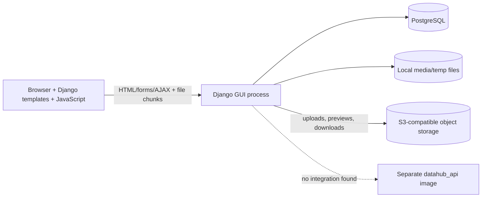
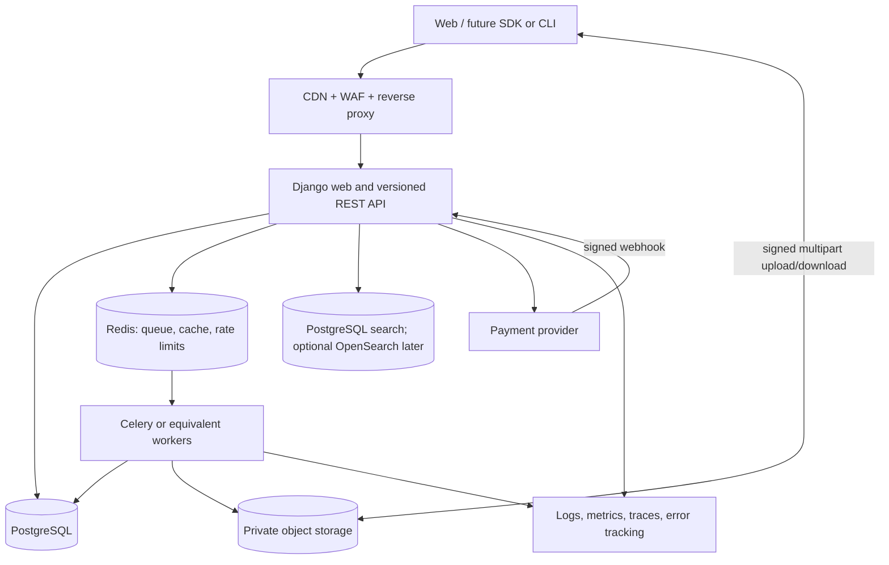
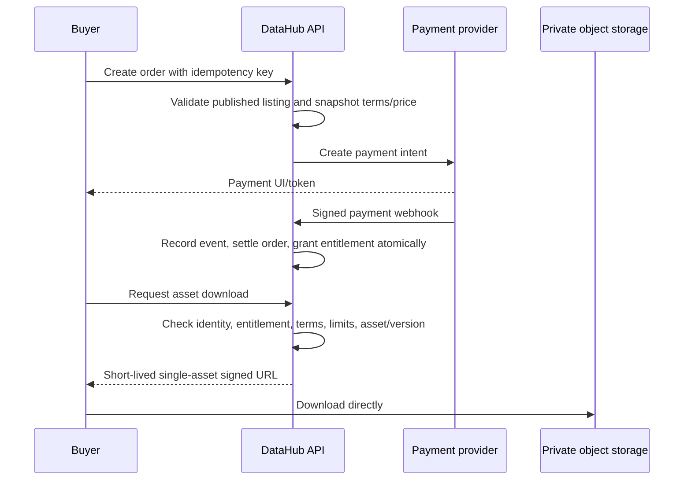

# DataHub GUI: architecture assessment and scalable product plan

Status: architecture baseline and modernization plan  
Repository reviewed: `datahub_gui` on branch `main`  
Review date: 2026-09-29

## 1. Executive summary

This repository is a useful product prototype, but it is not ready to operate as a secure data marketplace. It currently provides:

- Django-rendered catalog, dataset detail, profile, and marketplace-request pages.
- Dataset metadata, tags, likes, comments, related products, and annotation requests.
- Chunked browser uploads followed by storage in an S3-compatible service.
- CSV/Excel/JSON/Parquet preview through pandas and PygWalker.
- PostgreSQL configuration and Docker Compose definitions.

The most important architectural gap is that the product promise and the implementation do not yet match. The code uploads and catalogs files, but it does not execute a defined, versioned, auditable preprocessing pipeline. The marketplace records access requests, but it has no order, payment, entitlement, settlement, or enforced download authorization model.

The recommended target is a **modular Django monolith plus asynchronous workers**, not an immediate microservice rewrite. Keep one deployable application while the domain is evolving, split it into explicit modules, move file work to workers, upload directly to object storage, and enforce all access through entitlements. Extract a service only after load or team ownership demonstrates a real boundary.

Before any public deployment, complete the P0 security work: rotate exposed credentials, move secrets out of source control, require authentication and authorization on every mutation and file operation, restore CSRF protection, restore TLS verification, and prevent downloads without a valid entitlement.

### Implementation status (2026-10-01)

A first security and deployment-baseline correction pass has now been applied in this repository:

- Django, database, and object-storage credentials are read from environment configuration; .env.example documents required local variables without real secrets. Any previously committed credentials must still be rotated and purged from Git history.
- Django production security settings, trusted-host configuration, secure cookies, HTTPS redirect/HSTS controls, and a production Gunicorn container entrypoint are configured. The Docker image runs as a non-root user, Compose builds the local GUI, and PostgreSQL is pinned to major version 16.
- Dataset operations have initial authentication/object-access checks; upload mutations require login, POST, CSRF, and session ownership. Restricted assets fail closed, while paid assets require an active marketplace entitlement (with owner/admin bypass).
- Annotation decisions and marketplace request actions are scoped to the dataset owner; email-verification routing and account activation were corrected.
- S3 TLS verification is enabled, downloads are streamed where the current path permits, the browser like action uses POST with CSRF, and the dependency file was converted from UTF-16 to UTF-8 with Gunicorn added.
- .dockerignore excludes local secrets, Git metadata, virtual environments, and local media from the build context.
- The ineffective null=True option on the dataset likes relation was removed and migration dataset.0003_alter_dataset_likes was applied; the Compose format warning was also removed.
- Dataset prices now use fixed-precision DecimalField storage through migration dataset.0004_alter_dataset_price_decimal; future marketplace amounts will not use binary floating-point values.
- Organizations and memberships were added, together with dataset lifecycle status, immutable version records, dataset assets, and database migrations. Existing datasets remain organization-null for compatibility and must be backfilled before tenant isolation is enforced.
- Upload state is now persisted in UploadSession and UploadPart rows, scoped to the authenticated owner, with UUID identifiers, expiry checks, duplicate-part protection, size validation, and cleanup. The preferred browser flow now creates a persisted S3 multipart session, uploads parts directly to presigned S3 URLs, verifies the completed object size and SHA-256, and registers the asset without receiving upload bytes through Django's browser request. The legacy server-side chunk path remains available as a controlled fallback; the integrity read from object storage should move to a worker or native object checksum when very large-file load requires it.
- Regression coverage now includes authentication/registration, dataset access policy, CSRF-protected login, owner-scoped persistent uploads, direct S3 multipart coordination, five-stage workflow rendering, multi-file batches, archive safety, content-signature validation, image profiling, derived outputs, privacy redaction, and pipeline lifecycle transitions. The current suite passes 42 tests, along with Django system checks and migration consistency checks.
- Durable preprocessing orchestration is now defined through `PipelineDefinition`, `PipelineRun`, `PipelineStepRun`, and `QualityReport`. The application service provides idempotent enqueueing, row-locked run claiming, controlled review/failure transitions, and safe retries. Upload finalization now creates an immutable version, quarantined source asset, SHA-256 provenance, and queued standard pipeline run. A management-command worker performs bounded CSV/TSV/JSON quality checks, emits conservative PII column-name signals, and stops at human review.
- Archive quality inspection is now implemented for ZIP and TAR-family assets. The worker streams an archive to temporary disk, verifies its full checksum and size, rejects traversal paths, duplicate names, links, excessive member counts, unsafe compression ratios, and oversized contents, and records image counts, extensions, directory counts, and top-level entries without extracting untrusted files. 7z/RAR files remain reviewable but are reported as unsupported for deep inspection.
- Pipeline security validation now checks known binary signatures, rejects obvious filename/content spoofing, detects encrypted ZIP members, supports a configurable strict extension allowlist, and exposes an optional ClamAV/clamdscan adapter (`disabled`, `optional`, or `required`) through worker settings. ClamAV remains disabled by default until the worker image is provisioned with the scanner.
- Validated ZIP/TAR archives now receive bounded image profiling without extraction: Pillow checks readability and decompression-bomb limits, while the quality report records dimensions, formats, corrupt-image counts, and duplicate-content counts.
- The worker now creates bounded derived preview assets: image archives receive a JPEG contact sheet, while CSV/TSV/JSON sources receive a small preview file. Preview assets are checksummed, registered as `DatasetAsset` records, and written to the source bucket when the source is cloud-backed.
- CSV, TSV, and JSON sources below the configured normalization limit now produce deterministic Snappy-compressed Parquet `derived` assets with input/output checksums, row/column manifests, and explicit skip reasons for large or unsupported inputs.
- Valid image members are now normalized to bounded RGB/JPEG derived assets with source-path manifests; the original archive and original image bytes remain immutable.
- Bounded value-level email/phone/SSN-like signals now accompany column-name PII signals, and generated tabular previews redact matching values before storage. Originals are never modified.
- Dataset detail now exposes the latest quality report, image/duplicate/PII findings, derived-asset counts, and an owner/admin publication action. An owner-scoped pipeline-status endpoint supports progress polling.
- `cleanup_pipeline` expires abandoned upload sessions/batches and requeues stale worker runs; structured pipeline start/completion events include run, version, and derived-asset identifiers.
- A signed, idempotent connector handoff now accepts completed Kaggle/Hugging Face import manifests, verifies the connector HMAC, approved quarantine bucket, object prefix, and stored object size, then creates a quarantined GUI dataset/version and queues the existing pipeline. The API connector still needs to be refactored to call this contract; its current direct writes to catalog models should not be used.
- Redis/Celery infrastructure is now defined in Compose with a dedicated `worker` service, post-commit task dispatch, late acknowledgements, time limits, and a durable management-command fallback. The rebuilt worker connected successfully to Redis and registered `dataset.process_pipeline_run`.
- Publication is now an explicit owner/admin transition: reviewed versions require a quality report, persist the approver and timestamp, publish their assets atomically, and are exposed through a POST/CSRF-protected endpoint. Failed-quality versions cannot be published.
- Marketplace access foundations are now present in the `marketplace` app: published-version listings, integer minor-unit pricing, idempotent orders, payment-event deduplication, active entitlements, and paid-download policy enforcement. Signed webhook verification, seller credit/debit ledger entries, refund records, and entitlement revocation are now implemented; provider-specific settlement and reconciliation remain.

This is an initial containment pass, not a production-readiness signoff. dataset/views_openstack.py remains an unrouted legacy implementation and should be removed after confirming no external import depends on it; its in-memory upload tracker is still not horizontally scalable. Direct browser-to-S3 multipart upload is implemented with an automatic legacy fallback for missing CORS/ETag support, but production rollout still requires object-storage CORS/ETag configuration, a browser-reachable S3 endpoint, load testing, and CI coverage. Full malware-service provisioning, provider-specific payment adapters, payout/reconciliation workflows, migration plan for existing PostgreSQL volumes, and CI pipeline remain to be implemented. Redis/Celery execution is configured; production broker operations and monitoring remain. Review the Compose database major-version change against any existing volume before deployment.

## 2. Scope and method

This assessment covers the files in this repository, including Django settings, URLs, models, views, migrations, templates, JavaScript upload clients, Docker configuration, repository contents, and regression tests.

`docker-compose.yml` builds the separate sibling `datahub_api` project as the provider-import service. The GUI remains the system of record for catalog, versions, preprocessing, publication, and marketplace data; the API owns provider import jobs and submits signed manifests to the GUI.

Validation now runs in the Compose environment: Django system checks pass, migration drift checks pass, and the current regression suite passes eight tests covering authentication, registration, access policy, CSRF, and persistent upload ownership. Host-level Django commands may still be unavailable unless dependencies are installed locally.

## 3. Current architecture



### Current request flows

1. The preferred browser flow creates an `UploadSession` through `upload_direct/create`, requests short-lived presigned `upload_part` URLs, and uploads each part directly to S3-compatible storage.
2. The browser submits the returned ETags to `upload_direct/complete`; Django completes the multipart upload, verifies object size and SHA-256 with a streaming object-storage read, and registers a quarantined `DatasetAsset` without receiving the upload body from the browser.
3. The legacy `upload_dataset` endpoint remains available for environments where direct S3 uploads are disabled, and stores bounded parts before server-side assembly.
4. Preview requests download the object into a local temporary file, load the full file into pandas, sample it, and render PygWalker HTML.
5. Download requests fetch the entire S3 object through Django and return it to the browser.
6. Marketplace requests update a `Request.responseType`; this state is not used to authorize file access.

### Useful foundations worth retaining

- Django's app model gives a reasonable starting point for domain modularization.
- PostgreSQL is already the intended primary database.
- S3-compatible object storage is the correct class of storage for dataset assets.
- Uploads are chunked in the browser and database creation uses `transaction.atomic()`.
- Dataset metadata, tagging, annotations, comments, and product relationships capture useful early domain knowledge.
- Presigned URLs are already understood in the implementation, although they need to be used differently.

## 4. Findings and risks

### P0: release blockers

| Finding | Evidence | Impact | Required action |
|---|---|---|---|
| Secrets are committed | `datahub_gui/settings.py:13`, `:105`, `:169-170`; `docker-compose.yml:7-9` | Database, storage, sessions, and user data can be compromised | Rotate every exposed value immediately, purge secrets from Git history, and load them from a secret manager/environment |
| Unsafe production settings | `DEBUG=True`, wildcard hosts, development server in `Dockerfile:14` | Information exposure and unsafe/unreliable serving | Split settings by environment; use Gunicorn/Uvicorn behind a reverse proxy; enable Django production security settings |
| Upload is unauthenticated and CSRF-exempt | `dataset/views.py:434-435`; no ownership-bound upload session | Anonymous storage abuse, forged requests, upload hijacking | Require login, CSRF, quotas, a server-created upload session, and session ownership checks |
| Dataset access is not enforced | Download requires only login; preview/file pages accept any dataset ID | Any authenticated user can download paid/restricted data; previews can expose raw content | Centralize a `can_view`/`can_download` policy and require a valid entitlement on every data path |
| Marketplace is not commerce | `Request` only has request/accept/reject; no orders, payments, entitlements, ledger, refunds, or settlement | Displayed prices do not create enforceable purchases | Implement the marketplace lifecycle in section 8 before calling the feature buy/sell |
| TLS verification is disabled | S3 clients and direct uploads use `verify=False`; warnings are globally disabled | Man-in-the-middle attacks and credential/data theft | Install the correct CA chain and require certificate verification everywhere |
| Authorization is missing on mutations | Request acceptance uses a submitted ID without constraining it to the dataset owner; product and annotation operations have similar patterns | Horizontal privilege escalation | Scope every query to the authenticated actor/organization and enforce permissions in services/policies |
| Registration/verification paths conflict | The routed registration view immediately activates users, while the verification-capable view is not routed; the verification URL does not supply required parameters | Email ownership is not verified | Keep one registration flow, use named URL reversing, and add end-to-end tests |

### P1: scalability and integrity blockers

| Finding | Evidence | Impact | Required action |
|---|---|---|---|
| Legacy upload state lives in process memory | `upload_tracker = {}` in unrouted `dataset/views_openstack.py` | Legacy path fails across restarts or multiple web replicas | Keep the preferred persisted S3 multipart path enabled; remove the legacy implementation after dependent integrations are verified |
| Web workers process and proxy large files | Chunk `.read()`, local assembly, pandas loads, and `response.content` | Memory exhaustion, timeouts, low concurrency, expensive bandwidth | Direct upload/download with short-lived signed URLs; asynchronous processing workers; streaming where proxying is unavoidable |
| Bucket naming is effectively per upload | Bucket name contains the current timestamp | Bucket explosion, hard lifecycle management, inconsistent ownership boundary | Use a small fixed bucket set and tenant/dataset/version object prefixes |
| No real preprocessing state machine | Upload finalization immediately creates the catalog record | Unvalidated or unsafe data can become visible; no reproducibility | Quarantine first, execute a versioned pipeline, publish only after required checks pass |
| Core fields use unsuitable types | Record count and size are strings; money is float; statuses are nullable strings; links are JSON blobs | Invalid states, rounding errors, difficult queries and migrations | Use typed fields, constraints, enums, normalized asset/version tables, and integer minor currency units or `DecimalField` |
| Dataset ownership is optional | `Dataset.user` is nullable | Orphaned assets and ambiguous authorization | Make tenant and owner required; use protected deletion where business records must survive account changes |
| No immutable dataset versions | Files and mutable metadata live on `Dataset` | Buyers cannot reproduce what they purchased; updates can silently change the product | Add immutable `DatasetVersion` and `DatasetAsset`; listings and entitlements reference a version |
| No idempotency/concurrency protection | Duplicate requests and state updates are unconstrained | Double submissions, duplicate charges, race conditions | Add uniqueness constraints, idempotency keys, row locks for transitions, and payment provider event IDs |
| Monolithic/duplicated view code | `dataset/views.py` is about 1,480 lines; `views_openstack.py` is about 849; duplicate viewer/annotation implementations exist | Unsafe changes and hard testing | Split HTTP adapters, application services, policies, storage adapters, and background tasks |
| API boundary is ambiguous | Compose starts `datahub_api`, but GUI code never calls it | Duplicate domain logic and inconsistent authorization are likely | Choose one system of record and publish an explicit versioned API contract |

### P2: maintainability and operational gaps

- Search is an `icontains` scan over denormalized tag text; start with indexed PostgreSQL full-text/trigram search and add OpenSearch only when justified.
- Exceptions are frequently returned to clients or printed. Use structured logs, stable public error codes, correlation IDs, and private exception reporting.
- CI gates, type checks, linting, dependency/security scans, health checks, metrics, and tracing are still not configured.
- The requirements file is UTF-16 and appears to be a full environment freeze rather than a curated application dependency set.
- Docker uses unpinned `postgres:latest`, copies the whole repository, runs as root, has no health checks, and launches Django's development server.
- About 724 MB of frontend assets and generated/sample media are stored in the repository; temporary upload chunks are also committed. This increases clone/build time and risks data leakage.
- URL, field, and method naming is inconsistent (`camelCase`, underscores, `_fa` suffixes, missing trailing slashes). Establish conventions for a stable public API.
- User-controlled files are parsed without a clear allowlist, decompression limit, malware scan, formula-injection handling, or parser isolation.
- Sample/previews are derived on demand from the source object and can disclose sensitive columns. Store policy-approved preview artifacts instead.

## 5. Recommended product architecture

### Architectural decision

Start with a **modular monolith** containing the web UI, REST API, domain services, and persistence, plus independently scaled worker processes. This offers transactional consistency and faster product iteration without preserving the current giant-view structure.



### Suggested Django modules

| Module | Responsibility |
|---|---|
| `identity` | Accounts, verified email, organizations, memberships, roles, service accounts |
| `catalog` | Datasets, immutable versions, metadata, schema, tags, visibility, publication |
| `ingestion` | Upload sessions, multipart coordination, asset verification, quotas |
| `pipelines` | Pipeline definitions, runs, step runs, quality results, derived artifacts |
| `governance` | Licenses, policies, moderation, PII classifications, retention, takedowns |
| `marketplace` | Listings, prices, access requests, orders, entitlements, refunds |
| `billing` | Provider integration, payment events, platform fees, seller ledger and payouts |
| `annotations` | Annotation projects, proposals, assignments, deliverables |
| `audit` | Append-only security and business audit events |
| `notifications` | Transactional email and in-app notification delivery |

Within each module, keep four layers:

1. **HTTP adapters**: Django views/API serializers. Parse input and return responses only.
2. **Application services**: use cases such as `FinalizeUpload`, `PublishDatasetVersion`, or `GrantEntitlement`.
3. **Domain/policies**: transitions, invariants, pricing rules, and authorization decisions.
4. **Infrastructure adapters**: ORM repositories, S3, queue, search, email, and payment provider.

Views must not contain boto3 configuration, pandas processing, payment logic, or authorization rules.

## 6. Canonical data model

The exact schema should be refined through migrations, but these concepts should be explicit rather than embedded in JSON fields.

### Identity and tenancy

- `Organization(id, name, slug, status, created_at)`
- `Membership(organization_id, user_id, role, status)` with a unique organization/user constraint
- `SellerProfile(organization_id, verification_status, payout_account_ref)`

Every commercial dataset belongs to an organization. All tenant-owned tables carry `organization_id`; repository/service queries must scope by it.

### Catalog and assets

- `Dataset(id, organization_id, slug, title, description, visibility, status, current_version_id, created_by)`
- `DatasetVersion(id, dataset_id, version, status, pipeline_definition_version, license_id, published_at, checksum_manifest)`
- `DatasetAsset(id, dataset_version_id, kind, object_key, original_name, media_type, byte_size, sha256, status)`
- `SchemaColumn(id, dataset_version_id, position, name, logical_type, nullable, classification)`
- `QualityReport(id, dataset_version_id, result, score, metrics_json, report_asset_id)`
- `DatasetTag(dataset_id, tag_id)`
- `License(id, code, name, terms_url, commercial_use, redistribution)`

Important constraints:

- Unique `(dataset_id, version)`.
- Unique asset checksum/object identity as appropriate.
- Positive byte sizes and record counts.
- Published versions are immutable.
- A listing can reference only a published, approved version.

### Ingestion and processing

- `UploadSession(id UUID, organization_id, created_by, status, expected_size, media_type, expires_at, multipart_upload_id)`
- `UploadPart(upload_session_id, part_number, etag, byte_size, checksum)`
- `PipelineDefinition(id, name, version, definition_json, active)`
- `PipelineRun(id, dataset_version_id, definition_id, status, started_at, finished_at, error_code)`
- `StepRun(id, pipeline_run_id, step_key, status, attempt, input_manifest, output_manifest, metrics_json)`

### Marketplace and financial records

- `Listing(id, dataset_version_id, seller_org_id, status, access_model, currency, amount_minor, terms_version)`
- `AccessRequest(id, listing_id, buyer_org_id, status, decided_by, decided_at)`
- `Order(id, buyer_org_id, listing_id, status, amount_minor, currency, idempotency_key)`
- `Payment(id, order_id, provider, provider_reference, status, amount_minor, raw_event_hash)`
- `Entitlement(id, buyer_org_id, dataset_version_id, status, starts_at, expires_at, order_id)`
- `DownloadGrant(id, entitlement_id, asset_id, token_hash, expires_at, max_uses, used_count)`
- `LedgerEntry(id, order_id, account, direction, amount_minor, currency, created_at)`
- `Refund(id, payment_id, amount_minor, status, provider_reference)`

Do not use floating point for money. Prefer integer minor units plus an ISO currency, or a correctly constrained decimal representation when the payment provider requires it.

## 7. Dataset lifecycle and preprocessing

### Dataset/version state machine

```text
DRAFT -> UPLOADING -> QUARANTINED -> PROCESSING -> NEEDS_REVIEW -> PUBLISHED
                         |               |               |
                         v               v               v
                      REJECTED         FAILED         SUSPENDED -> ARCHIVED
```

Transitions must occur through application services, not arbitrary `.update()` calls. Store who caused each transition, when, why, and the previous/new states in the audit log.

### Standard ingestion workflow

1. The authenticated publisher creates a draft dataset and an upload session.
2. The API validates quota, allowed media type, expected size, and organization permissions.
3. The browser uploads parts directly to private object storage using short-lived signed multipart URLs.
4. The browser submits part ETags/checksums; the API atomically completes the upload session.
5. The source asset is placed in a quarantine prefix and a pipeline job is queued through a transactional outbox.
6. Workers execute a versioned pipeline:
   - Verify size and SHA-256 checksum.
   - Detect actual format rather than trusting filename or MIME headers.
   - Scan for malware and archive bombs.
   - Parse with resource limits in an isolated worker/container.
   - Extract schema, row count, encoding, and basic statistics.
   - Detect PII/secrets and classify columns.
   - Apply declared normalization: column naming, types, missing values, duplicates, encodings, and approved redaction.
   - Run configurable quality rules and produce a machine-readable report.
   - Write immutable normalized output, preferably Parquet for tabular data.
   - Generate a small, redacted preview artifact and documentation/data card.
7. Required failures move the version to `FAILED` or `NEEDS_REVIEW`; they never publish automatically.
8. Approval publishes that immutable version, updates the search index, and emits an audit/domain event.

### Reproducibility requirements

Every processed version must record:

- Source and output checksums.
- Pipeline definition name and version.
- Container/package version for each step.
- Step parameters, start/end time, outcome, retry count, and logs reference.
- Input and output asset manifests.
- Quality policy and result.
- Approver and publication timestamp.

Retries must be idempotent: the same dataset version, pipeline version, and input checksum must not create conflicting outputs.

## 8. Marketplace and access lifecycle

### Purchase flow



For approval-required listings, an accepted `AccessRequest` permits checkout or creates an entitlement only when the listing is free. Acceptance alone must never bypass payment for a paid listing.

### Mandatory marketplace rules

- Snapshot price, license/terms version, dataset version, seller, and fees on the order.
- Verify payment webhooks cryptographically and handle duplicate/out-of-order events idempotently.
- Grant entitlement only from a trusted server-side payment state transition.
- Record platform fees, seller payable amount, refunds, and payouts in an append-only ledger.
- Define refund, takedown, version update, entitlement expiry, and seller deletion behavior.
- Keep source objects private. Generate download URLs only after authorization and audit the grant.
- Apply per-user/org rate and download limits without exposing storage credentials.

### Central authorization policy

All UI and API paths must call the same policy. A download is allowed only if one of these is true:

- The actor owns/administers the dataset's organization.
- The asset is explicitly public and the published version permits public download.
- The actor's organization has an active entitlement for the exact dataset version.
- A narrowly scoped staff/support permission is active and audited.

Authentication is not authorization. Hiding a button is not authorization. Object IDs supplied by the browser are never proof of access.

## 9. Storage and data-serving strategy

- Use private buckets such as `datahub-source`, `datahub-derived`, and `datahub-preview`, or one bucket with equivalent prefixes and lifecycle policies.
- Use opaque object keys: `org/{org_uuid}/datasets/{dataset_uuid}/versions/{version_uuid}/assets/{asset_uuid}`. Never use a user filename as the authoritative key.
- Store the original filename only as metadata and sanitize it when building `Content-Disposition`.
- Enable server-side encryption, bucket versioning where useful, lifecycle expiration for incomplete uploads/quarantine, and retention rules aligned with contracts.
- Prefer direct signed multipart upload and direct signed download. Do not proxy large data through Django.
- For browser multipart uploads, configure object-storage CORS for the GUI origin with `PUT` (and `GET`/`HEAD` as needed), allow the request headers used by the SDK/browser, and expose the `ETag` response header. The presigned endpoint must resolve from the user's browser; an internal Compose hostname such as `minio` is not browser-reachable outside the Docker network.
- Keep `DIRECT_S3_UPLOADS=true` as the preferred path. The UI now aborts a failed multipart session and falls back automatically to the persisted legacy chunk path when browser CORS/ETag negotiation is unavailable; set `DIRECT_S3_UPLOAD_FALLBACK=false` if an environment must fail closed instead. Setting `DIRECT_S3_UPLOADS=false` disables direct uploads entirely while the object store is being configured; the fallback is less scalable and should not be the long-term production path.
- Signed URLs should be short-lived, asset-specific, generated after policy checks, and never persisted as the entitlement itself.
- Cache only public metadata and approved preview artifacts; never cache private source objects at a public CDN.
- Use checksums at client/part/object levels and reconcile orphan database rows/objects through scheduled jobs.

## 10. Security and governance baseline

### Immediate secret response

1. Rotate the committed Django, database, and object-storage credentials now.
2. Remove them from settings and Compose; load runtime values from a managed secret store or injected environment variables.
3. Rewrite Git history if this repository has ever left a trusted machine, then invalidate all old credentials regardless.
4. Add secret scanning to pre-commit and CI.

### Application controls

- Require verified accounts; support organization RBAC (`owner`, `admin`, `publisher`, `buyer`, `viewer`).
- Add object-level policy tests for every endpoint and service method.
- Keep CSRF protection for session-authenticated requests; use secure, HTTP-only, SameSite cookies.
- Configure HTTPS redirect, HSTS, secure cookies, trusted origins, strict allowed hosts, CSP, and safe proxy headers.
- Add login/upload/download/payment rate limits and abuse quotas.
- Validate request bodies with Django forms/DRF serializers; return stable errors without internal exception text.
- Escape user text by default. Treat generated PygWalker/HTML and spreadsheet content as untrusted.
- Scan files; impose compressed/uncompressed, row, column, memory, CPU, and execution time limits.
- Maintain an append-only audit trail for security, publishing, access, order, refund, and admin actions.
- Define data retention, deletion, export, takedown, and incident-response procedures.
- Never log raw files, presigned URLs, credentials, payment payload secrets, or unnecessary PII.

## 11. API and frontend contract

Expose a versioned API, even while Django templates remain the primary UI:

```text
/api/v1/datasets/
/api/v1/datasets/{id}/versions/
/api/v1/upload-sessions/
/api/v1/upload-sessions/{id}/parts/
/api/v1/pipeline-runs/{id}/
/api/v1/listings/
/api/v1/orders/
/api/v1/entitlements/
/api/v1/assets/{id}/download-grants/
/api/v1/payment-webhooks/{provider}/
```

Use UUIDs externally, cursor pagination for large collections, ISO-8601 UTC timestamps, consistent snake_case JSON, structured error objects, and idempotency keys for create/finalize/payment operations. Publish an OpenAPI contract and run contract tests against it.

The GUI owns canonical catalog, version, pipeline, publication, and marketplace records. `datahub_api` may remain a separate provider connector: it owns provider import jobs and stages downloaded source objects, then submits a signed completion manifest to the GUI at `/dataset/api/v1/external-imports`. The GUI creates a quarantined version and queues its standard pipeline. Keep the API out of the GUI's canonical tables; sharing the PostgreSQL server is acceptable when each service owns distinct tables and migrations.

The completion endpoint uses `X-DataHub-Timestamp` and `X-DataHub-Signature`. The signature is the lowercase hex HMAC-SHA256 of `<unix-timestamp>.<exact-request-body>`, using `EXTERNAL_IMPORT_HMAC_SECRET`; requests expire after five minutes. The API writes the source file to an approved bucket (`EXTERNAL_IMPORT_BUCKETS`) at `external-imports/{provider}/{sha256(request_key)}/...`, then sends this manifest:

```json
{
  "request_key": "stable-import-job-id",
  "provider": "huggingface",
  "external_dataset_id": "owner/dataset-name",
  "owner_user_id": 123,
  "metadata": {
    "name": "Dataset name",
    "owner": "Dataset owner",
    "description": "Description",
    "license": "license-id",
    "format": "csv",
    "reference_url": "https://huggingface.co/datasets/owner/dataset-name",
    "tags": ["tabular"]
  },
  "assets": [
    {
      "bucket": "datahub-quarantine",
      "object_key": "external-imports/huggingface/<request-key-sha256>/data.csv",
      "original_name": "data.csv",
      "byte_size": 1024,
      "sha256": "<64-character-lowercase-sha256>",
      "media_type": "text/csv"
    }
  ]
}
```

Retries with the same key and payload return the original receipt; reusing a key with different content returns HTTP 409. A successful new import returns HTTP 202 with dataset, version, and pipeline IDs. The connector must preserve the GUI user ID from the import request and use the same shared object store. Configure the GUI secret and approved bucket list before enabling this endpoint.

## 12. Deployment and operations

### Minimum production topology

- Reverse proxy/load balancer with TLS and request limits.
- At least two stateless Django web replicas using Gunicorn/Uvicorn.
- Separately scaled worker deployments for lightweight jobs and resource-heavy parsing.
- Managed PostgreSQL with backups, point-in-time recovery, connection pooling, and migration discipline.
- Redis with persistence/availability appropriate to whether it is only a cache or also a durable queue.
- Private S3-compatible object storage.
- Centralized logs, metrics, traces, alerting, and error tracking.

### Container standard

- Pin Python and base-image digest; use a multi-stage build.
- Install curated, hashed dependencies from UTF-8 lock/input files.
- Run as a non-root user with a read-only root filesystem and a dedicated temp volume.
- Copy only required source/static files via `.dockerignore`.
- Collect static assets during build and serve them from CDN/object storage.
- Run migrations as a release job, not in every web replica.
- Provide liveness, readiness, and startup health checks.
- Stop publishing PostgreSQL directly to the host in production.
- Pin the PostgreSQL major version and configure resource limits.

### Observability and service objectives

Track at least:

- HTTP latency/error rate by endpoint and status.
- Active/expired upload sessions, upload throughput, checksum failures, and orphaned parts.
- Queue depth, job latency, retries, step duration, and pipeline failure reasons.
- Object-storage latency/errors and bytes uploaded/downloaded.
- Orders/payment conversion, webhook failures, entitlement grants, refunds, and payout reconciliation.
- Authorization denials, suspicious download volume, and administrative actions.

Initial objectives should be explicit and reviewed after real traffic. For example: metadata API availability, p95 catalog latency, upload-finalization success rate, maximum queue-to-start delay, and recovery point/recovery time objectives. Do not promise dataset-processing latency until it is segmented by file size and pipeline class.

## 13. Engineering standards

### Code quality

- Python formatting/linting: Ruff; type checking: mypy with Django support where useful.
- Keep views thin; type public service interfaces; use domain-specific exceptions.
- Use Django `TextChoices`, database constraints, indexes, and timezone-aware timestamps.
- Replace raw `.filter(id=submitted_id).update(...)` mutations with ownership-scoped service methods.
- Remove dead/duplicate code (`views1.py`, redundant viewer classes, and unused storage implementation) after coverage protects behavior.
- Use structured logging rather than `print`.
- Record architecture decisions under `docs/adr/`.

### Test pyramid

- Unit tests for state machines, prices/fees, quality rules, and authorization policies.
- Model tests for constraints and migrations.
- Service tests for upload finalization, publication, access approval, purchase, refund, and entitlement revocation.
- API tests for authentication, CSRF, object-level authorization, validation, pagination, and idempotency.
- Storage/payment contract tests against local emulators or provider sandboxes.
- End-to-end tests for publisher upload-to-publication and buyer purchase-to-download.
- Security regression tests proving that another user cannot mutate, preview, or download a dataset.
- Load tests for direct multipart upload coordination, catalog browsing, and download-grant creation—not by sending dataset bytes through Django.

CI should block merges on tests, migration drift, lint/type failures, leaked secrets, vulnerable dependencies/images, and failed container health checks.

## 14. Phased implementation roadmap

### Phase 0 — contain critical risk

- Rotate/purge secrets and introduce environment-based settings.
- Fix the verified registration route.
- Require login, CSRF, HTTP method restrictions, and ownership policies on all mutations.
- Add one central `can_view_dataset`, `can_preview_asset`, and `can_download_asset` policy; deny by default.
- Disable paid/restricted downloads until entitlement enforcement exists.
- Restore TLS certificate verification.
- Remove committed temporary chunks and private/generated media; strengthen `.gitignore` and add `.dockerignore`.
- Add security regression tests for all identified horizontal-access paths.

Exit criterion: no known endpoint lets an unauthenticated or unauthorized actor create, modify, preview, approve, or download another party's data.

### Phase 1 — establish a deployable baseline

- Split production/development/test settings.
- Curate dependencies and build a hardened production container.
- Add CI, meaningful tests, structured logging, health checks, and error tracking.
- Refactor giant views into services/policies/adapters without changing product behavior.
- Decide and document whether this repository or `datahub_api` owns domain logic.

Exit criterion: a clean checkout can build, migrate, test, and run reproducibly; production deploys are observable and rollbackable.

### Phase 2 — rebuild ingestion and preprocessing

- Introduce `DatasetVersion`, `DatasetAsset`, `UploadSession`, and pipeline tables.
- Roll out the implemented direct S3 multipart upload with persisted session state and expiration; validate CORS, browser reachability, retries, orphan cleanup, and load limits in each deployment.
- Add Redis/worker infrastructure and transactional outbox delivery.
- Implement quarantine, validation, malware/PII detection, schema extraction, quality checks, normalized output, and safe previews.
- Publish only immutable versions that pass the required pipeline and review policy.

Exit criterion: web replicas are stateless; uploads survive restarts; every published version is reproducible and has a quality/provenance record.

### Phase 3 — implement a real marketplace

- Introduce organizations, listings, orders, payments, entitlements, download grants, ledger entries, refunds, and payouts.
- Integrate one payment provider through signed, idempotent webhooks.
- Enforce entitlements on every preview/download path.
- Add license/terms snapshots, invoices/receipts, dispute/refund handling, and reconciliation jobs.

Exit criterion: a paid file cannot be retrieved before successful payment and entitlement grant; duplicate requests/webhooks cannot double-charge or double-settle.

### Phase 4 — scale based on measurements

- Add PostgreSQL search indexes first; introduce OpenSearch only for demonstrated search needs.
- Add caching, CDN delivery of public previews/static files, read replicas, and partitioning only where metrics justify them.
- Separate heavy pipeline worker pools by resource class.
- Extract a service only for an independently owned, operationally distinct bottleneck.

Exit criterion: capacity tests meet documented objectives and scaling actions are driven by measured bottlenecks.

## 15. First implementation backlog

The following order minimizes rework:

1. Incident-style secret rotation and configuration cleanup.
2. Authorization inventory and deny-by-default policy layer.
3. Regression tests around upload, preview, request approval, annotation, product creation, and download.
4. Refactor `datahub_api` to own provider import jobs only, then connect it to the GUI through the signed manifest endpoint documented in section 11.
5. Organization/tenant ownership and immutable dataset versions.
6. Production validation of direct multipart upload and persistent upload sessions (CORS, browser-reachable endpoints, retries, orphan cleanup, and load tests).
7. Worker queue, transactional outbox, and preprocessing state machine.
8. Safe preview/quality/provenance artifacts.
9. Listings/orders/payments/entitlements/ledger.
10. Hardened containers, CI/CD, monitoring, backups, and load/security testing.

## 16. Product definition of done

A scalable DataHub release should not be considered complete until:

- Every dataset asset belongs to an organization and immutable dataset version.
- Every published version has checksums, provenance, schema, quality report, and a recorded pipeline version.
- All source objects are private and every preview/download is policy checked and audited.
- Paid access is represented by a verified order/payment and an active entitlement.
- Money and financial state are precise, idempotent, reconcilable, and append-only where required.
- Upload and processing survive web restarts and horizontal scaling.
- Large object bytes do not pass through Django during normal upload/download.
- Secrets are absent from Git and TLS verification is mandatory.
- CI proves tenant isolation and critical state transitions.
- Backups and restore procedures are tested, and operational objectives have alerts and runbooks.

## 17. Recommended architecture decisions to record

Create ADRs for these choices before implementation:

1. Modular monolith first; criteria for service extraction.
2. Which repository is the domain/API system of record.
3. Organization-based tenancy and role model.
4. Immutable dataset versioning and object key scheme.
5. Direct multipart upload/download strategy.
6. Queue/worker and transactional outbox technology.
7. Pipeline definition format and reproducibility contract.
8. Marketplace pricing, entitlement, ledger, refund, and payout semantics.
9. Search progression from PostgreSQL to a dedicated engine.
10. Data retention, deletion, PII, licensing, and audit policies.

This plan deliberately prioritizes correctness, security, and clear domain boundaries before microservices or aggressive infrastructure complexity. That creates a platform that can scale operationally while the product model continues to mature.
